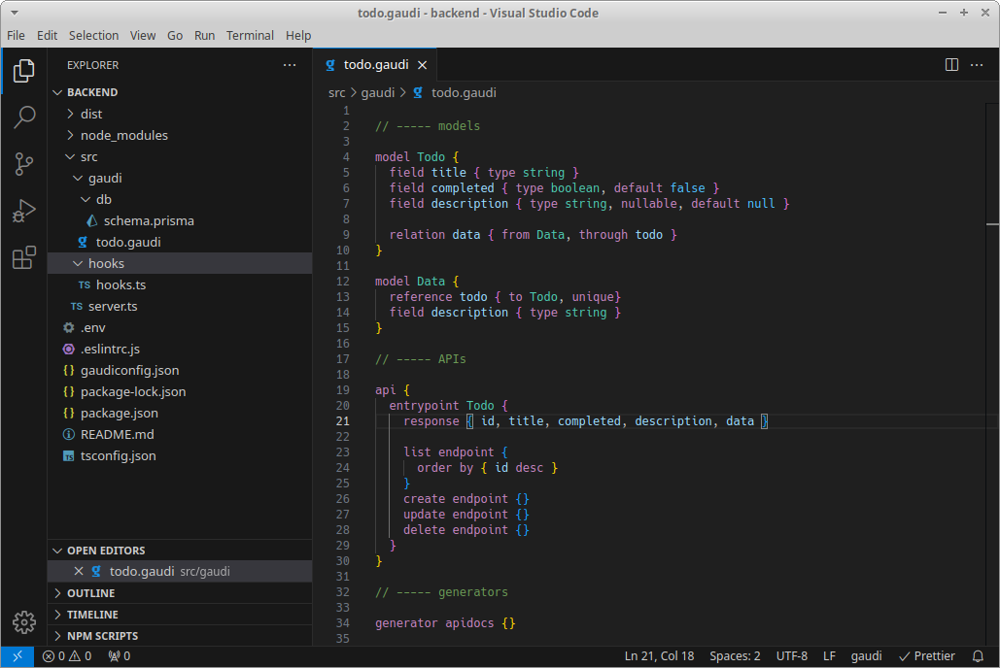

# Gaudi for Visual Studio Code

The [VS Code Gaudi extension](https://marketplace.visualstudio.com/items?itemName=gauditech) provides a language support for [Gaudi](https://gaudi.tech).

## Feature highlights

- syntax highlighting - display `.gaudi` files with highlighting
- code navigation - jump to identifier definition
- refactoring - rename identifier
- error reporting - see compiler error messages in context

## Quick Start

1. Install the [VS Code Gaudi extension TODO](https://marketplace.visualstudio.com/items?itemName=gauditech)
2. Open any directory or workspace containing Gaudi code and open `.gaudi` file to automatically activate the extension.

 
<em>Gaudi Extension Preview</em>

You're ready to Gaudi! 🎉
